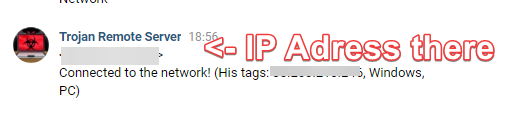

# **Malware Trojan**
## This repository is contains malware trojan that is written using Python.
## **Use this project only in educational purposes!**
## This project uses VK as control panel only at this moment, later i will add HTTP/TELEGRAM support, but now there is only VK control panel!

## Previews:



## Features:
- **Remote Access**: Syncing commands from the remote server (VK Only for now) and sending response back,
- **Stealing Data**: Stealing some data about client machine and sending to you,
- **Autorun**: Adding self in the Windows autorun,


## Operating systems:
### Supported
- **_Windows_**
### Partially supported:
- **_Linux_**
- **_MacOS_**

## Tested in the python version 3.9!

## Requirements:
- ```pip install -r requirements-max.txt``` Full support all features (Commands)
- ```pip install -r requirements-min.txt``` Not full support all features (Commands)
